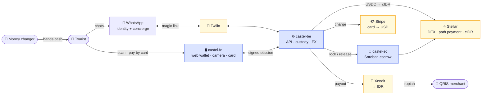

# Castel — Cash on Stellar

**A holiday wallet for the tourists Indonesia's payment system leaves out.**

Load it with a card. Pay any QRIS merchant in Bali. Take the rest home as cash.
No Indonesian bank account, no SIM card, no KTP. It runs on WhatsApp.

🔗 **Live demo:** [castelpay.vercel.app](https://castelpay.vercel.app) · API [castel-be.onrender.com](https://castel-be.onrender.com)
🎥 Built for the **APAC Stellar Hackathon 2026** — Track: *Local Finance & Real-World Access*.

---

## 📜 Deployed on Stellar (testnet)

| What | Address | Explorer |
|---|---|---|
| **Soroban escrow contract** | `CDG65OKWGLIOADVHGZXOF5QVH3HYQCRL4KBOCK5T67SOS4B246VXW6UG` | [view ↗](https://stellar.expert/explorer/testnet/contract/CDG65OKWGLIOADVHGZXOF5QVH3HYQCRL4KBOCK5T67SOS4B246VXW6UG) |
| **cIDR asset** (issuer) | `cIDR-GCH4XMY2LB67S2PYZUU5U23MCAB5DLUEQKGE4FRVF5NAJUMGC4SNTYEU` | [view ↗](https://stellar.expert/explorer/testnet/asset/cIDR-GCH4XMY2LB67S2PYZUU5U23MCAB5DLUEQKGE4FRVF5NAJUMGC4SNTYEU) |
| **cIDR Stellar Asset Contract** (SAC) | `CAEIXIESUULFDWKAVIJ4RWR6M3WJ557Q5IMIDT4DOW5DAYVRI4F3OUWE` | [view ↗](https://stellar.expert/explorer/testnet/contract/CAEIXIESUULFDWKAVIJ4RWR6M3WJ557Q5IMIDT4DOW5DAYVRI4F3OUWE) |

The **escrow contract** (`CDG65OKW…W6UG`) is the smart contract: a hashlocked escrow that
holds a tourist's rupiah on-chain until a money-changer agent proves possession of the
pickup code. Source and tests: **[castel-sc](https://github.com/CastelPay/castel-sc)**.

---

## Repositories

This repo (**castel-fe**) is the web wallet. The full system is three repos:

| Repo | What it is | Stack |
|---|---|---|
| **castel-fe** (this repo) | Web wallet — camera scan, card top-up, PIN | Next.js 16 · Tailwind 4 · Bun |
| **[castel-be](https://github.com/CastelPay/castel-be)** | API, custody, FX, settlement, auth | Hono · Bun · Postgres · stellar-sdk |
| **[castel-sc](https://github.com/CastelPay/castel-sc)** | Soroban escrow contract (Rust) | Rust · soroban-sdk |

---

## The problem

Bank Indonesia built **QRIS** to bring micro-merchants into digital payments — 45 million of
them, 93% MSMEs. It worked. But a tourist arriving from Australia, with an Australian phone
and card, has no practical way to pay that warung. Indonesia's wallets (GoPay, OVO, DANA)
each need a +62 SIM, an Indonesian debit card, a bank account and a KTP — four things a
tourist has none of.

BI's own **QRIS Cross-Border** covers six Asian countries. **Australia — Bali's #1 source
market at 23% of arrivals — is not one of them.** Neither are the US, UK, France, India or
Germany. Castel is for the visitors left outside.

---

## How it works



**WhatsApp is the account.** The phone number is the identity the tourist already owns. This
web app exists only for the two things a chat cannot do — **use a camera** and **take a card
number** — and reports back to the chat.

The tourist never sees the word "crypto": they deposit dollars and their balance reads in
rupiah, because the USDC→cIDR conversion happens the moment the card clears. Merchants and
agents always touch **rupiah**, never a digital asset.

Detailed architecture (simple + full diagrams): **[castel-be/ARCHITECTURE.md](https://github.com/CastelPay/castel-be/blob/main/ARCHITECTURE.md)**.

---

## What is actually real

Nothing in the core flow is mocked.

| | |
|---|---|
| **QRIS** | Real EMVCo TLV parser — decodes live merchant QR codes |
| **Card on-ramp** | Stripe Checkout (test mode) — a real card, charged in USD |
| **FX** | Stellar **path payment** across the built-in DEX — a real on-chain swap, priced against the live USD/IDR rate |
| **Merchant settlement** | Xendit Disbursement API (sandbox) — a real IDR payout call |
| **Cash-out** | Soroban escrow (`CDG65OKW…`) — hashlock, refund timelock, fee split, on-chain release |
| **Messaging** | Twilio WhatsApp sandbox — signature-verified webhook |

Testnet and sandbox keys throughout; no real money moves. cIDR has no fiat backing yet — see
[Honest limits](#honest-limits).

---

## Why Stellar

- **Path payments** — `USDC → cIDR` is one atomic operation across the protocol's built-in
  DEX, with a slippage bound from a live quote. No AMM to deploy, no router contract.
- **Native assets + compliance flags** — cIDR is a classic Stellar asset carrying
  `AUTH_REVOCABLE` and clawback, the same issuance pattern as USDC, PYUSD and MoneyGram's
  MGUSD. No token contract needed; a SEP-41 contract would have *removed* the DEX and path
  payments.
- **Soroban** — used only where custom on-chain logic is warranted: the cash-out escrow.

Merchants are always settled in Indonesian rupiah by a licensed payment provider — the
Stellar asset is never presented as a means of payment (crypto-as-payment is illegal in
Indonesia).

---

## This frontend

| Route | |
|---|---|
| `/wallet` | Sign in (WhatsApp OTP or magic link), set a PIN, top up by card, balance in **rupiah**, Tier 0 limit, history |
| `/pay` | Full-screen QRIS scanner → confirm → PIN → paid. Offers a top-up if the balance is short |
| `/cashout` | Request cash → PIN → a pickup QR to show a money-changer agent |
| `/agent` | The agent's side: scan the pickup QR, release the Soroban escrow |

**Auth.** The wallet holds a signed session token, never a phone number — obtained only by
proving control of the WhatsApp number (OTP or magic link). Spending requires a 6-digit PIN
that never travels through the chat. See **[castel-be/SECURITY.md](https://github.com/CastelPay/castel-be/blob/main/SECURITY.md)**.

**Stellar metadata.** [`public/.well-known/stellar.toml`](https://castelpay.vercel.app/.well-known/stellar.toml)
publishes the cIDR asset and Castel accounts (SEP-1). On-chain transactions link out to
Stellar Expert from the history list.

## Run locally

```bash
bun install
cp .env.example .env.local     # set NEXT_PUBLIC_API_URL to the backend
bun run dev                    # http://localhost:3000
```

Backend setup (custody, FX, Stellar bootstrap scripts) lives in
**[castel-be](https://github.com/CastelPay/castel-be#readme)**.

> `NEXT_PUBLIC_*` values are inlined at **build** time — changing one requires a redeploy.

---

## Honest limits

Listed before a reviewer finds them:

- **cIDR has no fiat backing yet.** It is a testnet asset with self-seeded liquidity. In the
  production model the issuer is an OJK-licensed provider holding rupiah 1:1 — the issuer
  already carries the compliance flags for that hand-off.
- **Custodial keys are stored in plaintext.** One database dump is every user's funds; the
  fix (envelope encryption under a KMS key) is understood, not yet built.
- **Card fees exceed the FX edge.** Stripe takes ~2.9% (more on a foreign card); the rate
  advantage over a money changer is under 1%. Castel is not the *cheapest* way to get rupiah
  — it is the only one available to a tourist with no Indonesian bank account.

## Roadmap

**Out of custody** — Stellar multisig (Castel as co-signer, not owner) → SEP-30 Recoverable
Wallets, whose identity model already supports `phone_number`.
**Become an anchor** — Bali's money changers already hold the rupiah float an inbound
remittance corridor needs; tourist FX bootstraps agent liquidity, and the same rails then
serve remittance recipients and unbanked locals.

---

*Castel — Cash on Stellar · [github.com/CastelPay](https://github.com/CastelPay)*
